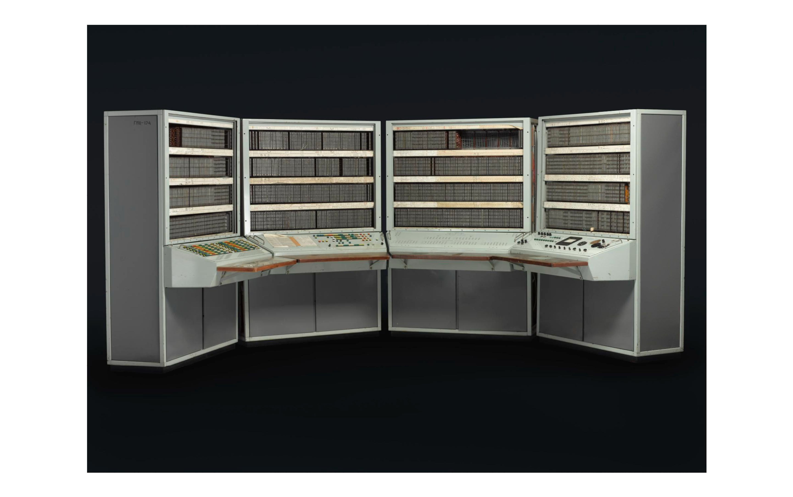
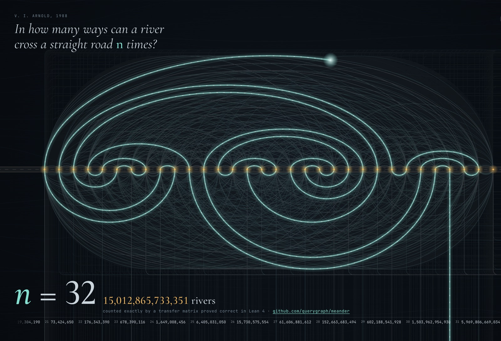
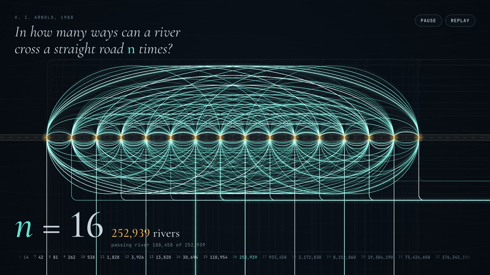

# How many ways can a river cross a road? Counting Arnold's meanders with proofs

When I was in high school, at the Math School N57 (one of the best math schools of the former USSR), following in the footsteps of my older brother, I found a stack of his line printer outputs.  It was from a Fortran program called REARRA.  It counted how many rivers could run through N bridges on a road.  That was a problem by the famous Soviet mathematician V.I. Arnold.  No closed-form solution is known to this day. I wanted to figure out a way to compute various metrics around it: what kinds of rivers are there, and with what kinds of meanders.  My mom was one of the first Soviet programmers at the Kurchatov Institute for Atomic Energy, computing the thermodynamics of the water-water nuclear reactors, VVRs.  (They had a hard shell as opposed to the air-water Chornobyl one.). Mom used BESM-6, the first Soviet supercomputer, for her calculations.  In the morning, she'd write the FORTRAN GDR (DDR, Leipzig friends) code on *blanks*, with a 6-character left field for GOTO labels, and then receive punchcards in the afternoon.  She took them home, proofread them, and numbered those OK in pencil.  If there was a typo, she had to wait.  Finally she'd assemble the job and bring it to the BESM-6 intake, where the pile was accepted and at some point in the day, loaded into the chute.  BESM-6 could multitask!  It had a magnetic drum for HDD!  Finally, the program ran, and a 128-character-wide line printer emitted a stack of perforated broadsheets, printed one whole line at a time, with the characters slightly out of alignment, up or down.  BESM-6:

I decided to add multiple metrics and SUBROUTINEs.  I worked on one at a time, using the meander-river generator and producing statistics.  I added one after the other for a week, following my mom's routine, giving her blanks in the morning and collecting the punch cards in the afternoons.  Eventually, I had about ten subroutines.  The pile now amounted to about 1,000 punch cards.  On the day X, I gave a half each to both parents (dad was a professor who also worked at the Kurchatov Institute, first with Kurchatov and then with Sakharov), so they wouldn't bulge too much.

The rejoined pile fit and ran at the first try, producing dozens of pages of beautiful ASCII revers and statistics.  The whole pile is still in my childhood apartment in Moscow.

And yesterday, reading about the pile of OpenAI math, I thought, why not do it in Lean now?  And after a day of work, we've proven an upper bound, built a faster counter with a transfer matrix, a visualization, and a LaTeX paper.  So here's the math!

In 1988 Vladimir Arnold asked a question a child could understand: in how many ways can a river cross a straight road *n* times? The river comes in from the south, crosses the road *n* times without ever crossing itself, and leaves to the east. Two rivers count as the same if one can be bent into the other without changing the order of the crossings. For one or two crossings there is one way. For three there are two, for four there are three, and then the numbers take off: 8, 14, 42, 81, 262, 538, 1,828, 3,926, 13,820.

Nobody knows a formula for them. Every known value was computed by a program, and the best programs are intricate. So we asked a narrower question: can we compute these numbers with programs that are *proved* to count exactly what Arnold asked, for every *n*? The answer is yes, and the result is a paper, [*Counting Arnold's Meanders with Verified Algorithms*](https://firstpair.org/books/arnold-meanders/), now on the Math shelf of the First Pair library, along with a film and an interactive visualization of the rivers.

## Watch the rivers

The film runs two minutes. The river starts with no bridges and simply flows past the road; then the road gains bridges one at a time, and each river is drawn from the south as the water lights up along it. Past eight crossings it stops drawing them one by one and races through every river there is: all 262 for nine crossings, all 30,694 for fourteen. Then it sweeps up to 32 crossings, where the counter stops at 15,012,865,733,351.

[Watch "Arnold's meanders" (1080p, 2 minutes)](https://github.com/querygraph/meander/releases/download/v1.0.0/arnold-meanders-1080p.mp4). A higher-quality master is [on the release page](https://github.com/querygraph/meander/releases/tag/v1.0.0).

The film is a recording of [the visualization](https://firstpair.org/learn/arnold-meanders/), which runs live in the browser. The rivers it draws are not illustrations: they come from an exact enumerator, and for every *n* up to 12 its counts match the proved values.

## What is proved

The work is a formalization in the [Lean 4](https://lean-lang.org/) proof assistant with the mathlib library, about 5,000 lines in all. Its starting point is a definition anyone can check: a river is the order in which it crosses the bridges, a permutation, and it is a meander when no two of its arcs on the same side of the road cross. Counting the permutations that pass this test is the specification. It is obviously right and hopelessly slow, since it looks at all *n*! orders.

Everything fast is then proved equal to that specification:

- **A search with a parity rule.** Build the river one bridge at a time and give up as soon as a new arc crosses an old one. Then add a rule from topology: every arc already drawn must enclose an even number of arc ends still to come, because those ends pair up inside it. At eleven crossings this cuts the search from 322,080 partial rivers to 14,471, and the proof that the rule never discards a real river is a short counting argument.
- **A transfer matrix.** Instead of following the river, scan the road from west to east and remember only how the strands that cross the cut are connected. Equal states are merged, states with more open arcs than the remaining bridges can close are dropped, and joining the two ends of one piece, which would close a loop, is refused. Proving this correct took most of the effort. The proof shows that the sequences the machine accepts correspond one to one with meanders, through a richer version of the machine that carries the actual pieces of river.
- **Two classical facts along the way.** A closed river crossing the road 2*n* times is the same thing as an open river crossing it 2*n* − 1 times, and there are at most *C*ₙ² closed ones, where *C*ₙ is the *n*-th Catalan number.

The verified transfer matrix computes every count up to 30 crossings in about half a minute, and up to 32 in a minute and a half. The values up to 13 crossings are checked by Lean's kernel alone, without trusting any compiled code. All counts up to 32 agree with the On-Line Encyclopedia of Integer Sequences.

None of this answers Arnold's question with a formula. That question is still open, and the best guesses, from statistical physics, suggest that if a formula exists it is not an elementary one. What the proofs do provide is certainty about every number we report, and a clear account of why the fast algorithms are right.

## Read it

- The paper: [PDF](https://firstpair.org/arnold-meanders/pdf/), [EPUB](https://firstpair.org/arnold-meanders/epub/), or [read it online](https://firstpair.org/read/arnold-meanders/). It includes a page with all eight rivers that cross a road five times.
- The visualization: [firstpair.org/learn/arnold-meanders](https://firstpair.org/learn/arnold-meanders/).
- The Lean development, the paper's source and the visualization: [github.com/querygraph/meander](https://github.com/querygraph/meander).

The formalization, the paper and the visualization were developed with Claude Code.
